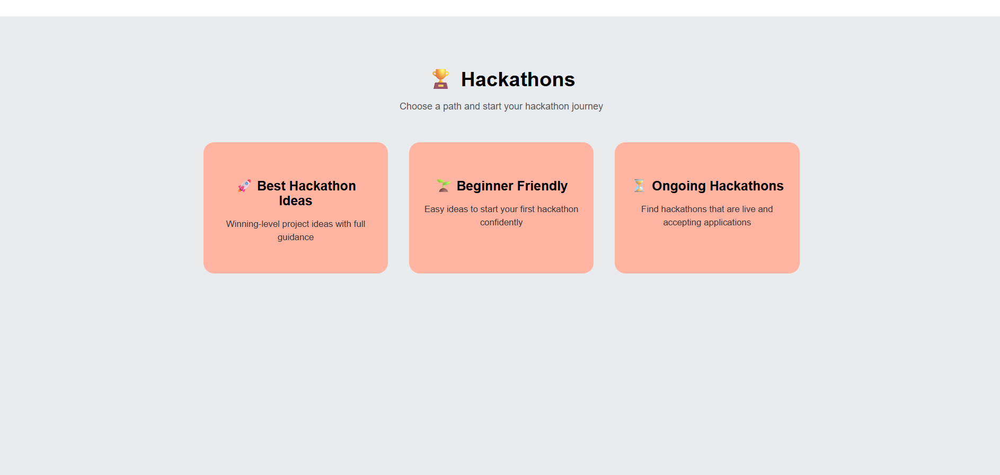
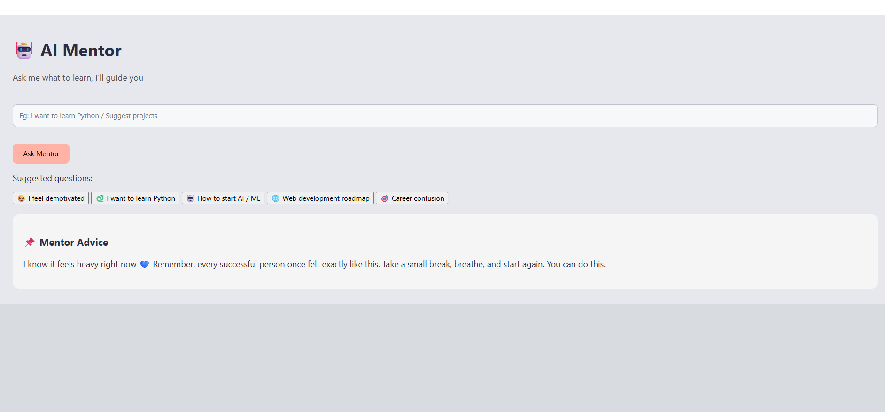
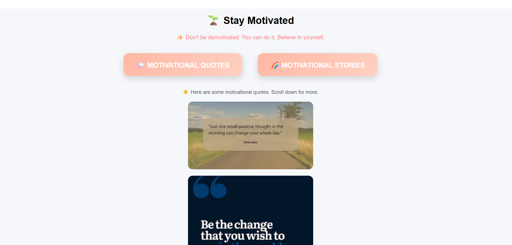

# UniSkill Nexus — Learn. Build. Grow.

An open-source student growth ecosystem where students can learn skills, build projects, discover hackathons, stay motivated, and get AI-powered guidance — all in one place.

## About the Application

UniSkill Nexus is a student-focused web application designed to help learners improve their skills in a structured and simple way.
The application brings together learning courses, project building, hackathon ideas, daily motivation, and performance tracking in one platform.

It is mainly created for beginners and college students who feel confused about where to start and how to progress step by step.

## Purpose of UniSkill Nexus

Many students struggle with:

Choosing the right skills to learn

Understanding how to build real projects

Finding beginner-friendly hackathon ideas

Staying motivated throughout their learning journey

UniSkill Nexus solves this problem by providing clear learning paths, practical ideas, and motivation in a single application.

## 🚀 Features

- 📚 Skill learning resources
- 🛠 Project building section
- 🏆 Hackathon discovery section
- 🤖 AI Mentor support
- 🔥 Daily motivational quotes
- 👤 User authentication & dashboard
- 📈 Growth tracking (future scope)

## Courses
The app provides skill-based courses from beginner to advanced levels.
Students can explore different technologies and start learning at their own pace.

## Projects
Project ideas are included to help students apply what they learn.
This encourages hands-on learning and practical experience.

## Hackathons
The platform includes beginner-friendly and best hackathon ideas.
Students can explore hackathon concepts without confusion.

## Daily Motivation
A daily motivation section is included to keep students inspired.
It helps learners stay consistent and positive.

## Login and Dashboard
Users can register and log in to access their personal dashboard.
All sections of the application are easily accessible from the dashboard.

## Open source ai mentor
If user selects "confused about career"
→ Show predefined advice

If user selects "need motivation"
→ Show motivational suggestion

## 🛠 Tech Stack

- Backend: Python (Flask)
- Frontend: HTML, CSS, JavaScript
- Database: SQLite
- Version Control: Git & GitHub

## ⚙️ How to Run Locally

1. Clone this repo:
git clone https://github.com/Sirivennela310505/Uniskill-Nexus---Learn-Build-Grow

2. Enter the project folder:
cd Uniskill-Nexus---Learn-Build-Grow

3. Install dependencies:
python -m pip install -r requirements.txt

4. Run the app:
python app.py

5. Open this link in browser:
http://127.0.0.1:5000/

## 📅 Hackathon Contribution Plan (March 1–31)

During the hackathon, planned improvements include:

- Improve UI responsiveness
- Add project search feature
- Add profile page with progress tracking
- Enhanced AI mentor logic (rule-based)
- Improve navigation and mobile support

## Project Developed By

Sirivennela
B.Tech Student

UniSkill Nexus – Learn, Build, and Grow

## Future Enhancements

More courses and project ideas

Improved performance tracking

Certificates for course completion

Enhanced user experience

## Application Screenshots

### Opening Page

### Login Page

### Dashboard

### Skills Page

### Skill Details

### Projects Page

### Hackathons Page

### AI Mentor
AI Mentor (rule-based system, future integration with open-source LLMs)

### Motivation Page

