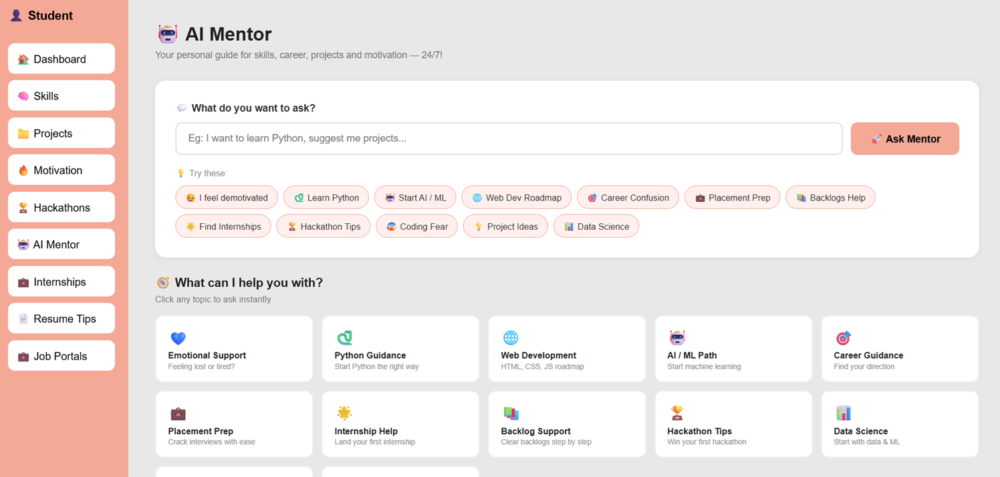
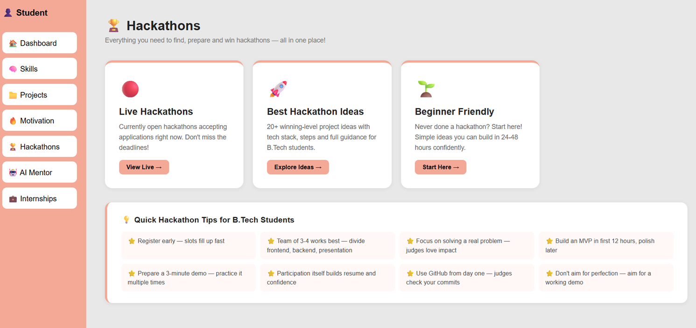
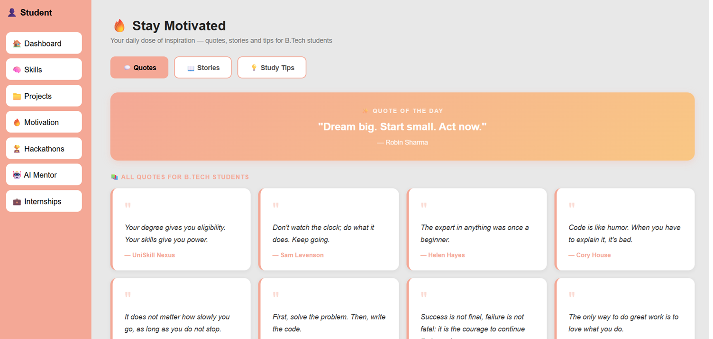
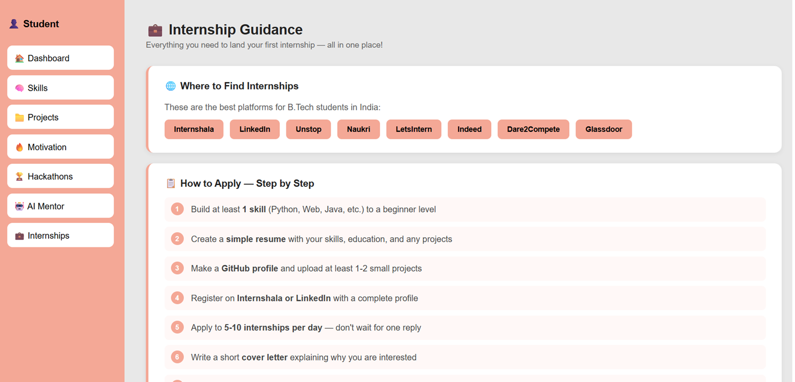
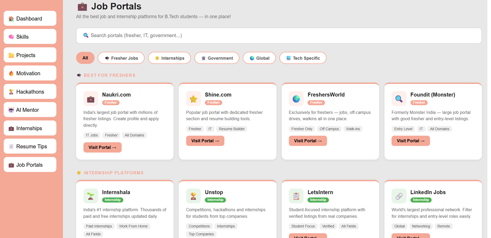
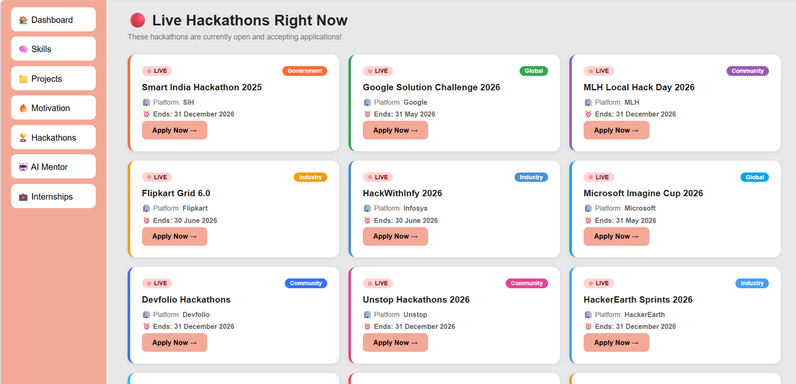
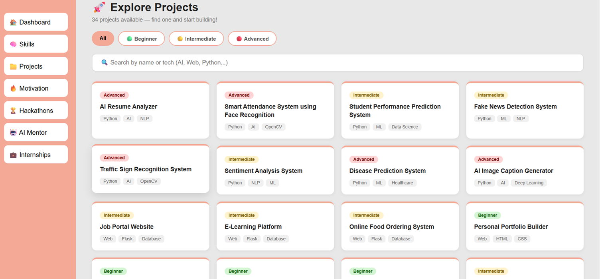

# 🎓 UniSkill Nexus — Learn. Build. Grow.

> A one-stop platform for B.Tech students to learn skills, build projects, discover live hackathons, find internships, jobs and get AI-powered guidance — all in one place! Built with Python Flask. 🚀

Built with ❤️ for every B.Tech student who ever felt lost or confused about where to start.

---

## 🌟 Why UniSkill Nexus?

Many B.Tech students struggle with:
- 😕 Not knowing which skills to learn
- 🔍 Searching 10 different websites for resources
- 😔 Feeling demotivated and lost
- 🏆 Not knowing how to participate in hackathons
- 💼 Finding internships and jobs

**UniSkill Nexus solves all of this in one place!**

---

## 🚀 Features

### 📚 Skills Section
- 7 skills: Python, Java, Web, AI/ML, Data Science, SQL, DSA
- Each skill has Roadmap, Resources and Quiz
- 10 random questions every time from question bank
- Resources with icons — YouTube, GitHub, Docs, Practice platforms

### 💻 Projects Section
- 34 projects with difficulty levels — Beginner, Intermediate, Advanced
- Tech stack tags on every project card
- Filter by level and search by name or technology
- Each project has its own specific step-by-step roadmap

### 🏆 Hackathons Section
- Live hackathons updated automatically by date
- 20+ best hackathon ideas with full guidance
- Beginner friendly ideas with time estimates
- 20+ platforms listed for finding more hackathons

### 🤖 AI Mentor
- Rule-based AI mentor for career and skill guidance
- 12 topic cards to ask instantly
- Covers emotional support, career, skills, placement, backlogs

### 🔥 Motivation
- Daily quote that changes every day automatically
- 16 motivational quotes specially for students
- 6 real inspiring stories for B.Tech students
- 10 practical study tips

### 💼 Internship Guidance
- Best platforms to find internships
- Step by step application guide
- Skills needed for each field
- Tips to get selected as a fresher

### 📄 Resume Tips
- Interactive checklist with score tracker and progress bar
- 9 pro tips with real examples
- 6 common resume mistakes with fixes
- 6 free resume template links

### 💼 Job Portals
- 20 job portals across 5 categories
- Filter by Fresher, Internship, Government, Global, Tech
- Search by name or keyword
- Job application tips for freshers

---

## 🛠️ Tech Stack

| Technology | Usage |
|-----------|-------|
| Python | Backend logic |
| Flask | Web framework |
| HTML | Frontend structure |
| CSS | Styling |
| JavaScript | Interactivity |
| SQLite | Database |
| Jinja2 | Templating engine |

---

## ⚙️ How to Run Locally
```bash
# 1. Clone the repository
git clone https://github.com/Sirivennela310505/Uniskill-Nexus---Learn-Build-Grow

# 2. Go into the folder
cd Uniskill-Nexus---Learn-Build-Grow

# 3. Install dependencies
pip install flask

# 4. Run the app
python app.py

# 5. Open in browser
http://127.0.0.1:5000/
```

---

## 📸 Screenshots

### 🏠 Dashboard


### 🤖 AI Mentor


### 🏆 Hackathons


### 🔥 Motivation


### 💼 Internships


### 💼 Job Portals


### 🔴 Live Hackathons


### 📁 Projects


### 🤖 AI Mentor Page


---

## 🔮 Future Enhancements

- 👤 User login with profile tracking
- 📈 Progress tracking for each skill
- 🏅 Certificates on course completion
- 📱 Mobile app version
- 🌐 Deploy on cloud (Render / Railway)

---

## 👩‍💻 Developed By

**Siri Vennela**
B.Tech Student | Aspiring Developer

> "Your degree gives you eligibility. Your skills give you power." — UniSkill Nexus

---

## 📄 License

This project is licensed under the MIT License — see the LICENSE file for details.

---

⭐ If this project helped you, please give it a star on GitHub!
